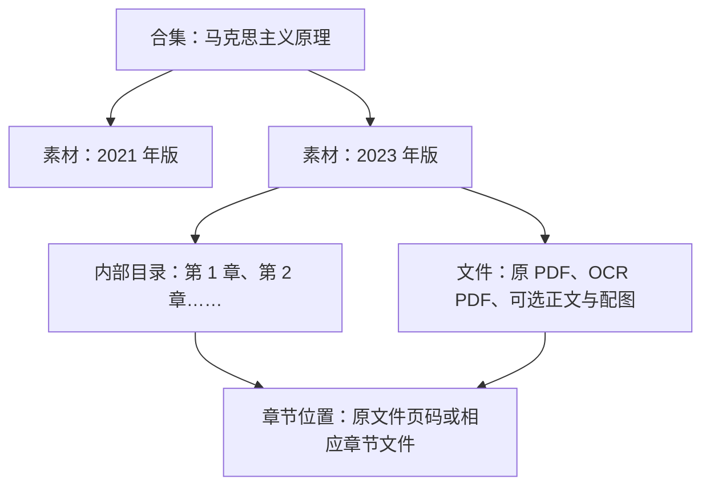

# 素材、文件、章节与合集：结构草案

日期：2026-10-01。根据用户最新描述绘制，等待整体确认；这是讨论用模型，尚未创建生产 schema 或迁移数据。

## 最新方向

用户倾向用合集组织独立资料，多个版次的《马克思主义原理》一起组织，一本具体版次的书的章节留在统一素材内。本文把用户提到的“合订本”沿用为前面讨论的“合集”；实际把多个 PDF 合并成一个文件是另一种导出动作，不在这里默认为需求。

已确认的“一条资料、多份文件”不要求 PDF＋Markdown。原 PDF＋OCR PDF 可以成立；章节是内容组织，文件是内容的保存或阅读形式。

## 建议的层级



这里有三种不同关系：

| 例子 | 产品含义 | 建议表示 |
| --- | --- | --- |
| 同一版的原 PDF、加文字层 PDF、Markdown、图片 | 同一内容的不同文件或处理产物 | 同一条素材内部的文件，记录角色与来源关系 |
| 一本书的第 1 章、第 2 章 | 同一素材内部的内容段落与导航 | 内部目录，定位到原件页码或章节文件，不要求每章建独立素材 |
| 2021 年版、2023 年版 | 有不同出版身份、可能不同内容的资料 | 分别成为素材，用合集或相关资料一起展示 |
| 同一版正文重新 OCR、校正错字 | 平台对这条素材的整理修订 | 保留修订，出版版次仍不变；案例引用固定修订 |

一章不要求恰好对应一个文件：整本 PDF 可以有章节目录；按章拆分的 PDF 也可以属于同一素材。一个文件也可能覆盖多个章节。上册、下册是否归入同一条素材，以及仅上传部分章节如何开放，仍待继续确认。

## 讨论用 schema：先表达含义

| 部分 | 需要表达的信息 | 当前边界 |
| --- | --- | --- |
| 合集 | 标题、简介、有序成员 | 成员指向独立条目，加入合集不替换原来的身份与权限 |
| 素材 | 标题、资料类型、作者／发布机构、来源、出版版次／日期、访问范围 | 本草案建议一条素材是明确的出版版次或来源；不是必填完整图书目录学信息 |
| 平台整理修订 | 本次文件清单、内部目录、可用正文与审核状态 | 出版版次与平台修订分别表达，遵循已定固定引用约束 |
| 文件 | 文件名、格式、角色、所属部分、从哪个文件派生 | 原件、OCR PDF、原文正文、整理／解读、图片和附件可按需要存在，没有固定两件套 |
| 内部目录 | 章节标题、顺序、层级、对应文件与位置 | 可以来自解析或管理员整理；没有可靠页码时不编造定位 |
| 正文与处理记录 | 对应文件或章节、原文／解读类型、待处理／待核对／已确认状态 | 原件先可读，正文需管理员确认后供 AI 使用；部分正文的启用方式仍待讨论 |

完整 PDF 可以用以下文件组合存在：

```text
素材：马克思主义原理（某一明确版次）
  原件：扫描 PDF
  处理后文件：带可搜索文字层的 PDF
  内部目录：第一章、第二章……，各自对应原件页码
  AI 可用正文：从已确认处理结果得到的章节文字
```

这个例子没有要求管理员上传 Markdown。若解析器输出 Markdown 与图片，也可保留它们；如果只有图片型 PDF、尚无可用正文，页面仍如实显示正文未就绪。文件的数量和大小限制是实施配置，不代替上述内容身份与组织关系。

## 一手来源与推论

- Zotero 官方有独立的版次、出版日期、出版社等字段，文件可以作为条目的附件；也支持将同一作品的不同版本关联。这支持分别表达书目身份、文件和条目间关系，并不要求本项目共用或拆分某个 ID。[条目字段](https://www.zotero.org/support/kb/item_types_and_fields#fields_for_books_and_periodicals)、[附件](https://www.zotero.org/support/attaching_files)、[相关条目](https://www.zotero.org/support/related)。
- Zotero 的合集可组织独立条目，同一个条目可出现在多个合集，不因加入而复制。[合集模型](https://www.zotero.org/support/collections_and_tags#the_zotero_collections_model)。
- BIBFRAME 区分概念内容、出版形态与实体／电子副本；本草案只参考这种区分，不引入其完整目录学层级。[美国国会图书馆官方模型](https://www.loc.gov/bibframe/docs/bibframe2-model.html)。
- OCRmyPDF 可生成带文字层的可搜索 PDF；不保证得到准确章节结构或正确阅读顺序。[官方说明](https://ocrmypdf.readthedocs.io/en/latest/introduction.html)。

这些来源支持概念可分开；上面的具体层级仍是本项目的产品建议。

## 与已有 Later 合集计划关联

现有 [建立专题集并提供主题案例入口](https://github.com/LittleDrinks/case-library/issues/100) 是 OPEN，位于 **Later：专题集、提示词细化与定向授权**。它目前只组织已发布案例，尚未定义素材成员。已有 [专题集决议](https://github.com/LittleDrinks/case-library/issues/150#issuecomment-5553724384) 也将其列为 Later。

本轮素材合集讨论与它关联；素材成员属于该计划待讨论的扩展，不自动提前整个合集功能，也不改变“案例专题显示当前公开版”和“案例引用固定素材修订”这两种不同使用关系。

## 下一步产品问题

1. 只上传若干章节时，能否先开放这条素材，并明确显示覆盖范围？
2. 案例选用一本资料时，是否首版就可以指定章节／页范围；如何区分资料整体与本案例实际使用范围？
3. 默认打开哪个阅读文件，是否由管理员指定？
4. AI 默认使用原文正文，还是同时检索单独标明的整理／解读？
5. 新版提示、历史失效资料选用与新闻收录仍未回答；不替用户决定。
